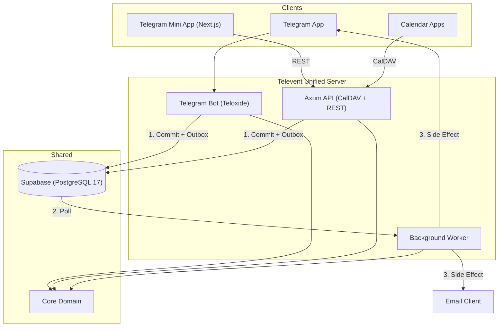
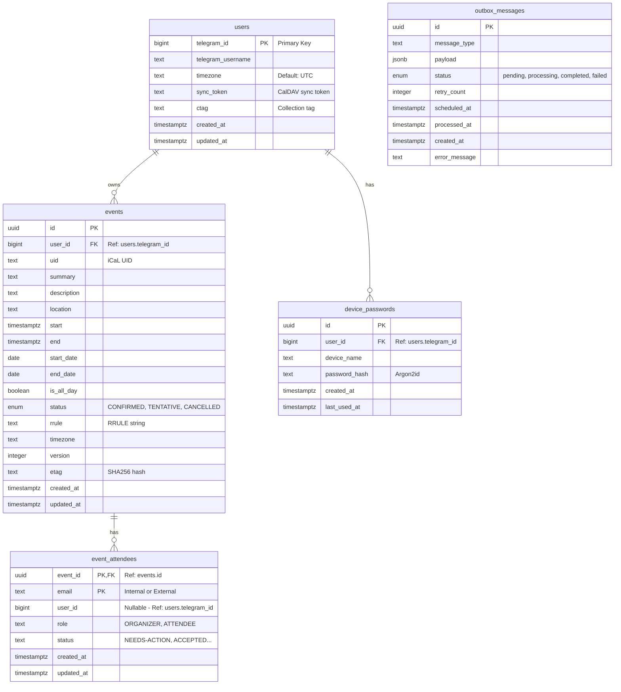

# Televent

Telegram-native calendar management with seamless CalDAV synchronization.

Televent bridges Telegram's conversational interface with standard CalDAV clients (Apple Calendar, Thunderbird, etc.), allowing for unified calendar management across platforms.

## System Architecture

The system follows a monorepo structure with shared core domain logic and multiple runtime services.



### Component Breakdown

| Path          | Description                                                      | Key Tech                       |
| ------------- | ---------------------------------------------------------------- | ------------------------------ |
| crates/core   | Domain Logic. Pure Rust, no I/O. Models, Errors, Timezone logic. | chrono, uuid                   |
| crates/api    | HTTP Server. Handles CalDAV protocol and REST endpoints.         | axum, tower                    |
| crates/bot    | Telegram Interface. Command parsing and conversational FSM.      | teloxide                       |
| crates/worker | Job Processor. Handles emails, notifications, and cleanups.      | tokio, lettre                  |
| crates/shared | Bootstrap & Common. Database pool, logging, shared utilities.    | sqlx, tracing                  |
| crates/server | Unified Entry Point. Runs API, Bot, and Worker in one process.   | tokio                          |
| frontend      | Frontend. Telegram Mini App and Web Dashboard.                   | Next.js 16, Tailwind 4, tma.js |
| migrations/   | Database Schema. SQLx migration files.                           | sql                            |

## Database Schema



### Schema Description

- **users**: Stores Telegram users. `telegram_id` is the primary key and links to Telegram's ecosystem. Calendar data (`sync_token`, `ctag`) is merged directly into this table (each user has one calendar).
- **events**: Calendar events. Linked to `users` via `user_id` (telegram_id). Supports both time-based and date-based (all-day) events.
- **event_attendees**: Participants in events. Uses a composite primary key `(event_id, email)`. Can be internal (linked via `user_id` if known) or external (email only).
- **device_passwords**: App-specific passwords for CalDAV clients (Thunderbird, iOS) to authenticate using Basic Auth, as Telegram doesn't provide passwords.
- **outbox_messages**: Transactional outbox for asynchronous tasks like sending emails or Telegram notifications. Includes `created_at` for auditing.

## Bot Commands

### Account Setup
- `/start` - Initialize account and see welcome message
- `/device` - Manage CalDAV device passwords (add/list/revoke)
- `/deleteaccount` - Delete your account and all data (GDPR)

### Event Management
- `/list` - List upcoming events
- `/cancel` - Cancel/delete an event
- `/export` - Export calendar as .ics file

### Coordination
- `/invite` - Invite someone to an event
- `/rsvp` - Respond to event invitations

### Help
- `/help` - Show help message

### Event Creation Format
To create an event, send a message with the following format:
```text
Event Title
Date/Time (e.g., 'tomorrow 10am', 'next monday 14:00', '2026-01-25 14:00')
Duration in minutes (optional, default: 60)
Location (optional)
```

## Technical Implementation Details

### Interceptor Pattern
The system generates internal email addresses (tg_telegramid@televent.internal). The background worker intercepts invites to these addresses and routes them to the Telegram Bot API as messages instead of sending them via SMTP.

### Outbox Pattern (Reliable Messaging)
The system uses the **Transactional Outbox** pattern to ensure that side effects (like sending a Telegram notification or an email) are guaranteed to happen if a database transaction succeeds.

1.  **Atomicity**: Both the data change (e.g., creating an event) and the "outbox" record are committed in a single database transaction.
2.  **Reliability**: The Background Worker polls the `outbox_messages` table and processes pending items. If a process fails or the worker crashes, the message remains in the outbox (often with a retry count) and will be picked up again.
3.  **Decoupling**: The main request handlers (Bot or API) don't wait for the external delivery to finish, making the system more responsive and resilient to external service outages (Telegram API or SMTP server).

### CalDAV Protocol
- ETag: SHA256 hash of the serialized event fields (clock-skew resistant).
- Sync Token: Atomic counter incremented on changes (Postgres sequence/RETURNING).
- Optimistic Locking: Updates require a matching ETag via If-Match header.

### Frontend Architecture
- **Framework**: Next.js 16 (React 19) with App Router.
- **Integration**: `tma.js` for Telegram Mini App bidirectional communication.
- **Styling**: Tailwind CSS v4 with `@catppuccin/tailwindcss` plugin for themes.
- **Type Safety**: `typeshare` ensures TypeScript interfaces match Rust models.


## Development and Operations

### Prerequisites
- [Nix](https://nixos.org/download.html) (recommended)
- [Rust](https://www.rust-lang.org/tools/install) (if not using Nix)
- [Node.js](https://nodejs.org/) & [pnpm](https://pnpm.io/)
- [Supabase CLI](https://supabase.com/docs/guides/cli)
- [Docker](https://www.docker.com/) (for local database)

### Common Commands

#### General
- `just setup-dev` - Initial setup (Supabase + migrations + build)
- `just run` - Run unified server (API, Bot, and Worker)
- `just upgrade` - Upgrade backend dependencies
- `just upgrade-frontend` - Upgrade frontend dependencies

#### Testing & Quality
- `just test` - Run all backend tests
- `just test-coverage` - Run tests with coverage report
- `just lint` - Run backend quality checks (clippy, fmt)
- `just lint-frontend` - Run frontend linting (ESLint)
- `just fmt-frontend` - Run frontend formatting (Prettier)

#### Database
- `just db-start` / `db-stop` - Manage local Supabase stack
- `just db-status` - Check Supabase status
- `just db-reset` - Full reset: drop db, re-create, apply migrations
- `just gen-types` - Generate TypeScript types from Rust models

### Agent Rules
- **No unwrap()/expect()**: Use explicit error handling.
- **Structured Logging**: Use `tracing` macros, never `println!`.
- **Type Safety**: Use newtypes (`UserId(Uuid)`) prevents ID confusion.
- **Tokio**: Use Tokio async runtime for everything.

## Project Roadmap

### Phase 2: Internal Invites (Current)
- [x] Database schema for attendees and RSVPs.
- [x] Implementation of the Interceptor logic in the worker.
- [x] Bot commands for RSVP management (/invite, /rsvp).
- [x] Logic for sending Telegram notifications to invitees.

### Phase 3: Staging and QA
- Validation against Supabase (production-like Postgres).
- Full end-to-end testing with GUI CalDAV clients.

### Phase 4: Frontend Development (Current)
- [x] Next.js foundation with Telegram SDK (tma.js).
- [x] Event Management (CRUD)
    - [x] Create/Edit Event Form (Catppuccin Mocha Theme)
    - [x] Event Listing
    - [x] Event Deletion
- [x] Typeshare integration for Rust-to-TypeScript safety.
- [ ] Mock mode for quick local iteration.

### Phase 5: Production Deployment
- Railway deployment (API, Bot, Worker, and Static Frontend).
- Live environment manual QA within Telegram.

### Phase 6: Expansion
- Extending the frontend to act as a standalone Web App.
- SMTP integration for external (non-Televent) invites.

## Current Status

### Working
- PostgreSQL Database infrastructure.
- Axum API Server with CalDAV support (RFC 4791 compliant).
- Telegram Bot core commands and event creation parsing.
- Background worker for outbox processing (emails and Telegram notifications).
- Unified server process running all services.
- CalDAV basic auth and event synchronization (verified with curl/cadaver).
- Event invitations and RSVP via Telegram Bot (Internal Invites fully enabled).
- Frontend:
    - Next.js + Tailwind + tma.js setup complete.
    - Basic routing and UI components (Catppuccin theme) implemented.
    - Event Creation/Edit Form and Event Listing fully integrated.
    - Event Deletion implemented.
    - Integration with Backend API complete.

### In Progress
- Mock mode for quick local iteration.
- Production deployment (Railway).
- SMTP integration for external (non-Televent) invites.


# Example prompt for agent 

Create professional prompt for following task:

i asked expert ui/ux freelancer to create concept application code for our project. it lays in 
expert_freelancer
. your goal is to integrate this design to our app with our backend. feel free to use freelancers code and move whole file and chunks, i bought rights for it. it is ours. but i did not give him our backend specification

allowed-tools: [Read, Write, Glob, SlashCommand, AskUserQuestion, serena mcp, context7 mcp, supabase mcp, brower]
remember to activate serena project
remeber to use tools through nix develop
can use browser for debugging

<context>
Before generating prompts, use the Glob tool to check `./prompts/*.md` to:
1. Determine if the prompts directory exists
2. Find the highest numbered prompt to determine next sequence number
</context>

<objective>
Act as an expert prompt engineer for Claude Code, specialized in crafting optimal prompts using XML tag structuring and best practices.

Create highly effective prompts for: $ARGUMENTS

Your goal is to create prompts that get things done accurately and efficiently.
</objective>

<process>

<step_0_intake_gate>
<title>Adaptive Requirements Gathering</title>

<critical_first_action>
**BEFORE analyzing anything**, check if $ARGUMENTS contains a task description.

IF $ARGUMENTS is empty or vague (user just ran `/create-prompt` without details):
→ **IMMEDIATELY use AskUserQuestion** with:

- header: "Task type"
- question: "What kind of prompt do you need?"
- options:
  - "Coding task" - Build, fix, or refactor code
  - "Analysis task" - Analyze code, data, or patterns
  - "Research task" - Gather information or explore options

After selection, ask: "Describe what you want to accomplish" (they select "Other" to provide free text).

IF $ARGUMENTS contains a task description:
→ Skip this handler. Proceed directly to adaptive_analysis.
</critical_first_action>

<adaptive_analysis>
Analyze the user's description to extract and infer:

- **Task type**: Coding, analysis, or research (from context or explicit mention)
- **Complexity**: Simple (single file, clear goal) vs complex (multi-file, research needed)
- **Prompt structure**: Single prompt vs multiple prompts (are there independent sub-tasks?)
- **Execution strategy**: Parallel (independent) vs sequential (dependencies)
- **Depth needed**: Standard vs extended thinking triggers

Inference rules:
- Dashboard/feature with multiple components → likely multiple prompts
- Bug fix with clear location → single prompt, simple
- "Optimize" or "refactor" → needs specificity about what/where
- Authentication, payments, complex features → complex, needs context
</adaptive_analysis>

<contextual_questioning>
Generate 2-4 questions using AskUserQuestion based ONLY on genuine gaps.

<question_templates>

**For ambiguous scope** (e.g., "build a dashboard"):
- header: "Dashboard type"
- question: "What kind of dashboard is this?"
- options:
  - "Admin dashboard" - Internal tools, user management, system metrics
  - "Analytics dashboard" - Data visualization, reports, business metrics
  - "User-facing dashboard" - End-user features, personal data, settings

**For unclear target** (e.g., "fix the bug"):
- header: "Bug location"
- question: "Where does this bug occur?"
- options:
  - "Frontend/UI" - Visual issues, user interactions, rendering
  - "Backend/API" - Server errors, data processing, endpoints
  - "Database" - Queries, migrations, data integrity

**For auth/security tasks**:
- header: "Auth method"
- question: "What authentication approach?"
- options:
  - "JWT tokens" - Stateless, API-friendly
  - "Session-based" - Server-side sessions, traditional web
  - "OAuth/SSO" - Third-party providers, enterprise

**For performance tasks**:
- header: "Performance focus"
- question: "What's the main performance concern?"
- options:
  - "Load time" - Initial render, bundle size, assets
  - "Runtime" - Memory usage, CPU, rendering performance
  - "Database" - Query optimization, indexing, caching

**For output/deliverable clarity**:
- header: "Output purpose"
- question: "What will this be used for?"
- options:
  - "Production code" - Ship to users, needs polish
  - "Prototype/POC" - Quick validation, can be rough
  - "Internal tooling" - Team use, moderate polish

</question_templates>

<question_rules>
- Only ask about genuine gaps - don't ask what's already stated
- Each option needs a description explaining implications
- Prefer options over free-text when choices are knowable
- User can always select "Other" for custom input
- 2-4 questions max per round
</question_rules>
</contextual_questioning>

<decision_gate>
After receiving answers, present decision gate using AskUserQuestion:

- header: "Ready"
- question: "I have enough context to create your prompt. Ready to proceed?"
- options:
  - "Proceed" - Create the prompt with current context
  - "Ask more questions" - I have more details to clarify
  - "Let me add context" - I want to provide additional information

If "Ask more questions" → generate 2-4 NEW questions based on remaining gaps, then present gate again
If "Let me add context" → receive additional context via "Other" option, then re-evaluate
If "Proceed" → continue to generation step
</decision_gate>

<finalization>
After "Proceed" selected, state confirmation:

"Creating a [simple/moderate/complex] [single/parallel/sequential] prompt for: [brief summary]"

Then proceed to generation.
</finalization>
</step_0_intake_gate>

<step_1_generate_and_save>
<title>Generate and Save Prompts</title>

<pre_generation_analysis>
Before generating, determine:

1. **Single vs Multiple Prompts**:
   - Single: Clear dependencies, single cohesive goal, sequential steps
   - Multiple: Independent sub-tasks that could be parallelized or done separately

2. **Execution Strategy** (if multiple):
   - Parallel: Independent, no shared file modifications
   - Sequential: Dependencies, one must finish before next starts

3. **Reasoning depth**:
   - Simple → Standard prompt
   - Complex reasoning/optimization → Extended thinking triggers

4. **Required tools**: File references, bash commands, MCP servers

5. **Prompt quality needs**:
   - "Go beyond basics" for ambitious work?
   - WHY explanations for constraints?
   - Examples for ambiguous requirements?
</pre_generation_analysis>

Create the prompt(s) and save to the prompts folder.

**For single prompts:**

- Generate one prompt file following the patterns below
- Save as `./prompts/[number]-[name].md`

**For multiple prompts:**

- Determine how many prompts are needed (typically 2-4)
- Generate each prompt with clear, focused objectives
- Save sequentially: `./prompts/[N]-[name].md`, `./prompts/[N+1]-[name].md`, etc.
- Each prompt should be self-contained and executable independently

**Prompt Construction Rules**

Always Include:

- XML tag structure with clear, semantic tags like `<objective>`, `<context>`, `<requirements>`, `<constraints>`, `<output>`
- **Contextual information**: Why this task matters, what it's for, who will use it, end goal
- **Explicit, specific instructions**: Tell Claude exactly what to do with clear, unambiguous language
- **Sequential steps**: Use numbered lists for clarity
- File output instructions using relative paths: `./filename` or `./subfolder/filename`
- Reference to reading the CLAUDE.md for project conventions
- Explicit success criteria within `<success_criteria>` or `<verification>` tags

Conditionally Include (based on analysis):

- **Extended thinking triggers** for complex reasoning:
  - Phrases like: "thoroughly analyze", "consider multiple approaches", "deeply consider", "explore multiple solutions"
  - Don't use for simple, straightforward tasks
- **"Go beyond basics" language** for creative/ambitious tasks:
  - Example: "Include as many relevant features as possible. Go beyond the basics to create a fully-featured implementation."
- **WHY explanations** for constraints and requirements:
  - In generated prompts, explain WHY constraints matter, not just what they are
  - Example: Instead of "Never use ellipses", write "Your response will be read aloud, so never use ellipses since text-to-speech can't pronounce them"
- **Parallel tool calling** for agentic/multi-step workflows:
  - "For maximum efficiency, whenever you need to perform multiple independent operations, invoke all relevant tools simultaneously rather than sequentially."
- **Reflection after tool use** for complex agentic tasks:
  - "After receiving tool results, carefully reflect on their quality and determine optimal next steps before proceeding."
- `<research>` tags when codebase exploration is needed
- `<validation>` tags for tasks requiring verification
- `<examples>` tags for complex or ambiguous requirements - ensure examples demonstrate desired behavior and avoid undesired patterns
- Bash command execution with "!" prefix when system state matters
- MCP server references when specifically requested or obviously beneficial

Output Format:

1. Generate prompt content with XML structure
2. Save to: `./prompts/[number]-[descriptive-name].md`
   - Number format: 001, 002, 003, etc. (check existing files in ./prompts/ to determine next number)
   - Name format: lowercase, hyphen-separated, max 5 words describing the task
   - Example: `./prompts/001-implement-user-authentication.md`
3. File should contain ONLY the prompt, no explanations or metadata

<prompt_patterns>

For Coding Tasks:

```xml
<objective>
[Clear statement of what needs to be built/fixed/refactored]
Explain the end goal and why this matters.
</objective>

<context>
[Project type, tech stack, relevant constraints]
[Who will use this, what it's for]
@[relevant files to examine]
</context>

<requirements>
[Specific functional requirements]
[Performance or quality requirements]
Be explicit about what Claude should do.
</requirements>

<implementation>
[Any specific approaches or patterns to follow]
[What to avoid and WHY - explain the reasoning behind constraints]
</implementation>

<output>
Create/modify files with relative paths:
- `./path/to/file.ext` - [what this file should contain]
</output>

<verification>
Before declaring complete, verify your work:
- [Specific test or check to perform]
- [How to confirm the solution works]
</verification>

<success_criteria>
[Clear, measurable criteria for success]
</success_criteria>
```

For Analysis Tasks:

```xml
<objective>
[What needs to be analyzed and why]
[What the analysis will be used for]
</objective>

<data_sources>
@[files or data to analyze]
![relevant commands to gather data]
</data_sources>

<analysis_requirements>
[Specific metrics or patterns to identify]
[Depth of analysis needed - use "thoroughly analyze" for complex tasks]
[Any comparisons or benchmarks]
</analysis_requirements>

<output_format>
[How results should be structured]
Save analysis to: `./analyses/[descriptive-name].md`
</output_format>

<verification>
[How to validate the analysis is complete and accurate]
</verification>
```

For Research Tasks:

```xml
<research_objective>
[What information needs to be gathered]
[Intended use of the research]
For complex research, include: "Thoroughly explore multiple sources and consider various perspectives"
</research_objective>

<scope>
[Boundaries of the research]
[Sources to prioritize or avoid]
[Time period or version constraints]
</scope>

<deliverables>
[Format of research output]
[Level of detail needed]
Save findings to: `./research/[topic].md`
</deliverables>

<evaluation_criteria>
[How to assess quality/relevance of sources]
[Key questions that must be answered]
</evaluation_criteria>

<verification>
Before completing, verify:
- [All key questions are answered]
- [Sources are credible and relevant]
</verification>
```
</prompt_patterns>
</step_1_generate_and_save>

<intelligence_rules>

1. **Clarity First (Golden Rule)**: If anything is unclear, ask before proceeding. A few clarifying questions save time. Test: Would a colleague with minimal context understand this prompt?

2. **Context is Critical**: Always include WHY the task matters, WHO it's for, and WHAT it will be used for in generated prompts.

3. **Be Explicit**: Generate prompts with explicit, specific instructions. For ambitious results, include "go beyond the basics." For specific formats, state exactly what format is needed.

4. **Scope Assessment**: Simple tasks get concise prompts. Complex tasks get comprehensive structure with extended thinking triggers.

5. **Context Loading**: Only request file reading when the task explicitly requires understanding existing code. Use patterns like:

   - "Examine @package.json for dependencies" (when adding new packages)
   - "Review @src/database/\* for schema" (when modifying data layer)
   - Skip file reading for greenfield features

6. **Precision vs Brevity**: Default to precision. A longer, clear prompt beats a short, ambiguous one.

7. **Tool Integration**:

   - Include MCP servers only when explicitly mentioned or obviously needed
   - Use bash commands for environment checking when state matters
   - File references should be specific, not broad wildcards
   - For multi-step agentic tasks, include parallel tool calling guidance

8. **Output Clarity**: Every prompt must specify exactly where to save outputs using relative paths

9. **Verification Always**: Every prompt should include clear success criteria and verification steps
</intelligence_rules>

<decision_tree>
After saving the prompt(s), present this decision tree to the user:

---

**Prompt(s) created successfully!**

<single_prompt_scenario>
If you created ONE prompt (e.g., `./prompts/005-implement-feature.md`):

<presentation>
✓ Saved prompt to ./prompts/005-implement-feature.md

What's next?

1. Run prompt now
2. Review/edit prompt first
3. Save for later
4. Other

Choose (1-4): \_
</presentation>

<action>
If user chooses #1, invoke via SlashCommand tool: `/run-prompt 005`
</action>
</single_prompt_scenario>

<parallel_scenario>
If you created MULTIPLE prompts that CAN run in parallel (e.g., independent modules, no shared files):

<presentation>
✓ Saved prompts:
  - ./prompts/005-implement-auth.md
  - ./prompts/006-implement-api.md
  - ./prompts/007-implement-ui.md

Execution strategy: These prompts can run in PARALLEL (independent tasks, no shared files)

What's next?

1. Run all prompts in parallel now (launches 3 sub-agents simultaneously)
2. Run prompts sequentially instead
3. Review/edit prompts first
4. Other

Choose (1-4): \_
</presentation>

<actions>
If user chooses #1, invoke via SlashCommand tool: `/run-prompt 005 006 007 --parallel`
If user chooses #2, invoke via SlashCommand tool: `/run-prompt 005 006 007 --sequential`
</actions>
</parallel_scenario>

<sequential_scenario>
If you created MULTIPLE prompts that MUST run sequentially (e.g., dependencies, shared files):

<presentation>
✓ Saved prompts:
  - ./prompts/005-setup-database.md
  - ./prompts/006-create-migrations.md
  - ./prompts/007-seed-data.md

Execution strategy: These prompts must run SEQUENTIALLY (dependencies: 005 → 006 → 007)

What's next?

1. Run prompts sequentially now (one completes before next starts)
2. Run first prompt only (005-setup-database.md)
3. Review/edit prompts first
4. Other

Choose (1-4): \_
</presentation>

<actions>
If user chooses #1, invoke via SlashCommand tool: `/run-prompt 005 006 007 --sequential`
If user chooses #2, invoke via SlashCommand tool: `/run-prompt 005`
</actions>
</sequential_scenario>

---

</decision_tree>
</process>

<success_criteria>
- Intake gate completed (AskUserQuestion used for clarification if needed)
- User selected "Proceed" from decision gate
- Appropriate depth, structure, and execution strategy determined
- Prompt(s) generated with proper XML structure following patterns
- Files saved to ./prompts/[number]-[name].md with correct sequential numbering
- Decision tree presented to user based on single/parallel/sequential scenario
- User choice executed (SlashCommand invoked if user selects run option)
</success_criteria>

<meta_instructions>

- **Intake first**: Complete step_0_intake_gate before generating. Use AskUserQuestion for structured clarification.
- **Decision gate loop**: Keep asking questions until user selects "Proceed"
- Use Glob tool with `./prompts/*.md` to find existing prompts and determine next number in sequence
- If ./prompts/ doesn't exist, use Write tool to create the first prompt (Write will create parent directories)
- Keep prompt filenames descriptive but concise
- Adapt the XML structure to fit the task - not every tag is needed every time
- Consider the user's working directory as the root for all relative paths
- Each prompt file should contain ONLY the prompt content, no preamble or explanation
- After saving, present the decision tree as inline text (not AskUserQuestion)
- Use the SlashCommand tool to invoke /run-prompt when user makes their choice
</meta_instructions>
