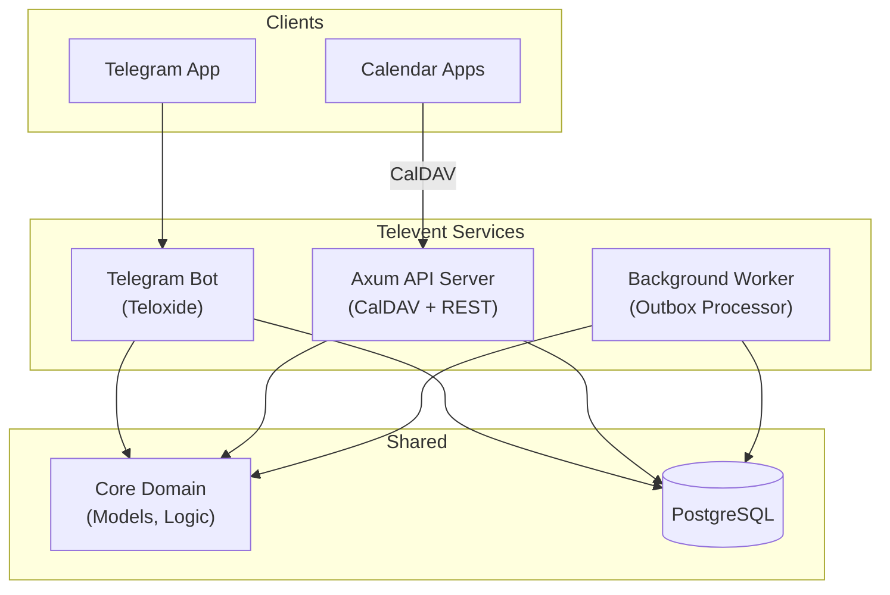

explore the codebase. it consists of a lot of documentation files. some of them in docs folder, some of them in readme. i want it all to be in a more optimal way. probably even in one structured readme file. i want you to update readme with all the documentation so all the other files are redundant. i dont like usage of emoji, i want readme to be llm ai agent friendly so agent can consult with it. when you are done with that, i want you to check documentation for being up to date, update state, architechture, commands, all the stuff.

# Televent

> **Telegram-native calendar management with seamless CalDAV synchronization.**

This repository contains the backend infrastructure for Televent, a system that bridges Telegram's conversational interface with standard CalDAV clients (Apple Calendar, Thunderbird, etc.).

## User Commands

### Account Setup
- `/start` - Initialize account and show setup instructions
- `/device add <name>` - Generate CalDAV password for a device
- `/device list` - Show all device passwords
- `/device revoke <id>` - Delete a device password

### Event Management
- `/create` - Create event (guided conversation flow)
- `/today` - List today's events
- `/tomorrow` - List tomorrow's events
- `/week` - List this week's events
- `/cancel <event_id>` - Cancel an event

### GDPR & Privacy
- `/export` - Request GDPR data export
- `/delete_account` - Initiate account deletion (30-day grace period)

## Command Details

### /create - Event Creation Flow

Interactive conversation to create events:

```
User: /create
Bot: "Event title?"
User: "Team standup"
Bot: "When? (e.g., 'tomorrow 10am' or '2026-01-20 14:00')"
User: "tomorrow 10am"
Bot: "Duration? (e.g., '30m', '1h')"
User: "30m"
Bot: "Description? (or /skip)"
User: "Weekly sync meeting"
Bot: ✅ "Event created: Team standup, Jan 19 10:00-10:30"
```

### Natural Language Date Parsing

Supported formats:
- `tomorrow 10am`
- `next monday 14:00`
- `2026-01-25 14:00`
- `in 2 hours`
- `at 3pm`

### Duration Format

- `30m` - 30 minutes
- `1h` - 1 hour
- `1h30m` - 1 hour 30 minutes
- `90m` - 90 minutes

## 🏗 System Architecture

The system follows a monorepo structure with shared core domain logic and multiple runtime services.



---

## 🚨 Zero Tolerance Rules (Agent Instructions)

**If you are an AI agent working on this codebase, you MUST adhere to these rules:**

1.  **NO `unwrap()` / `expect()`**:
    *   **Why:** We manage user calendar data. Panics cause data loss or sync corruption.
    *   **Do:** Use `?` propagation or explicit `match` handling.

2.  **NO `println!`**:
    *   **Why:** Production logs must be structured for Jaeger/Grafana ingestion.
    *   **Do:** Use `tracing::info!`, `tracing::warn!`, or `tracing::error!`.

3.  **Type Safety is Paramount**:
    *   **Why:** CalDAV has complex ID requirements. Mixing up a `CalendarId` and an `EventId` is fatal.
    *   **Do:** Use newtypes (`UserId(Uuid)`), not raw `Uuid`.

4.  **Async Runtime = Tokio**:
    *   **Why:** The entire stack (Axum, SQLx, Teloxide) is built on Tokio.

5.  **Database Migrations**:
    *   **Rule:** If you touch `core/src/models.rs`, you **must** create a migration.
    *   **Command:** `just db-new-migration <name>`

---

## 📂 Project Structure

| Path | Description | Key Tech |
|------|-------------|----------|
| `crates/core` | **Domain Logic**. Pure Rust, no I/O. Models, Errors, Timezone logic. | `chrono`, `uuid` |
| `crates/api` | **HTTP Server**. Handles CalDAV protocol and REST endpoints. | `axum`, `tower` |
| `crates/bot` | **Telegram Interface**. Command parsing and conversational FSM. | `teloxide` |
| `crates/worker` | **Job Processor**. Handles emails, notifications, and cleanups. | `tokio`, `lettre` |
| `crates/web` | **Frontend (Planned)**. Web dashboard for settings. | `dioxus` |
| `migrations/` | **Database Schema**. SQLx migration files. | `sql` |

---

## 🧠 Key Architectural Patterns

### 1. The "Interceptor" (Current Focus)
We invite users via Telegram, not Email. The system generates "internal" emails (`tg_123@televent.internal`). The worker intercepts these emails and routes them to the Telegram Bot API as messages instead of sending them via SMTP.

### 2. Outbox Pattern
We never send side effects (emails, TG messages) inside a database transaction.
1.  **Transaction:** Insert Event + Insert `outbox_message` (Pending).
2.  **Worker:** Polls `outbox_messages`, sends actual message, marks Complete.
*Guarantees atomicity and retry-ability.*

### 3. CalDAV Concurrency (ETags)
*   **ETag Source:** SHA256 hash of the serialized event fields.
*   **NOT Timestamp:** Timestamps are unreliable due to client clock skew.
*   **Optimistic Locking:** All updates require `If-Match: <etag>`.

---

## 📚 Documentation Index

*   [**CLAUDE.md**](CLAUDE.md) - **The Law**. Detailed coding standards and operational commands.
*   [**docs/ARCHITECTURE.md**](docs/ARCHITECTURE.md) - Deep dive into data flows, sequence diagrams, and database schema.
*   [**docs/DEVELOPMENT_ROADMAP.md**](docs/DEVELOPMENT_ROADMAP.md) - Current phase and future plans.