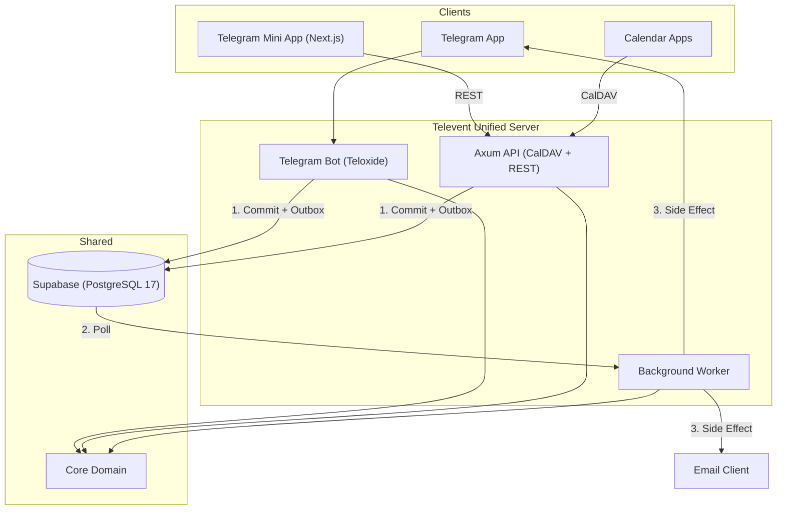
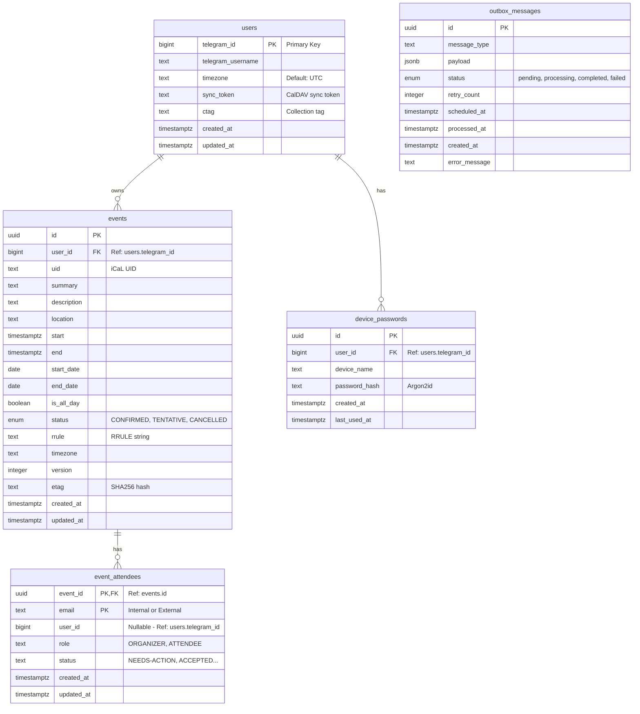

[](https://github.com/kirilledition/televent/actions/workflows/test.yml)
[](https://github.com/kirilledition/televent/actions/workflows/lint.yml)
[](https://github.com/kirilledition/televent/actions/workflows/test.yml)

# Televent

Telegram-native calendar management with seamless CalDAV synchronization.

Televent bridges Telegram's conversational interface with standard CalDAV clients (Apple Calendar, Thunderbird, etc.), allowing for unified calendar management across platforms.

## System Architecture

The system follows a monorepo structure with shared core domain logic and multiple runtime services.



### Component Breakdown

| Path          | Description                                                      | Key Tech                       |
| ------------- | ---------------------------------------------------------------- | ------------------------------ |
| crates/core   | Domain Logic. Pure Rust, no I/O. Models, Errors, Timezone logic. | chrono, uuid                   |
| crates/api    | HTTP Server. Handles CalDAV protocol and REST endpoints.         | axum, tower                    |
| crates/bot    | Telegram Interface. Command parsing and conversational FSM.      | teloxide                       |
| crates/worker | Job Processor. Handles emails, notifications, and cleanups.      | tokio, lettre                  |
| crates/shared | Bootstrap & Common. Database pool, logging, shared utilities.    | sqlx, tracing                  |
| crates/server | Unified Entry Point. Runs API, Bot, and Worker in one process.   | tokio                          |
| frontend      | Frontend. Telegram Mini App and Web Dashboard.                   | Next.js 16, Tailwind 4, tma.js |
| migrations/   | Database Schema. SQLx migration files.                           | sql                            |

## Database Schema



### Schema Description

- **users**: Stores Telegram users. `telegram_id` is the primary key and links to Telegram's ecosystem. Calendar data (`sync_token`, `ctag`) is merged directly into this table (each user has one calendar).
- **events**: Calendar events. Linked to `users` via `user_id` (telegram_id). Supports both time-based and date-based (all-day) events.
- **event_attendees**: Participants in events. Uses a composite primary key `(event_id, email)`. Can be internal (linked via `user_id` if known) or external (email only).
- **device_passwords**: App-specific passwords for CalDAV clients (Thunderbird, iOS) to authenticate using Basic Auth, as Telegram doesn't provide passwords.
- **outbox_messages**: Transactional outbox for asynchronous tasks like sending emails or Telegram notifications. Includes `created_at` for auditing.

## Bot Commands

### Account Setup
- `/start` - Initialize account and see welcome message
- `/device` - Manage CalDAV device passwords (add/list/revoke)
- `/deleteaccount` - Delete your account and all data (GDPR)

### Event Management
- `/list` - List upcoming events
- `/cancel` - Cancel/delete an event
- `/export` - Export calendar as .ics file

### Coordination
- `/invite` - Invite someone to an event
- `/rsvp` - Respond to event invitations

### Help
- `/help` - Show help message

### Event Creation Format
To create an event, send a message with the following format:
```text
Event Title
Date/Time (e.g., 'tomorrow 10am', 'next monday 14:00', '2026-01-25 14:00')
Duration in minutes (optional, default: 60)
Location (optional)
```

## Technical Implementation Details

### Interceptor Pattern
The system generates internal email addresses (tg_telegramid@televent.internal). The background worker intercepts invites to these addresses and routes them to the Telegram Bot API as messages instead of sending them via SMTP.

### Outbox Pattern (Reliable Messaging)
The system uses the **Transactional Outbox** pattern to ensure that side effects (like sending a Telegram notification or an email) are guaranteed to happen if a database transaction succeeds.

1.  **Atomicity**: Both the data change (e.g., creating an event) and the "outbox" record are committed in a single database transaction.
2.  **Reliability**: The Background Worker polls the `outbox_messages` table and processes pending items. If a process fails or the worker crashes, the message remains in the outbox (often with a retry count) and will be picked up again.
3.  **Decoupling**: The main request handlers (Bot or API) don't wait for the external delivery to finish, making the system more responsive and resilient to external service outages (Telegram API or SMTP server).

### CalDAV Protocol
- ETag: SHA256 hash of the serialized event fields (clock-skew resistant).
- Sync Token: Atomic counter incremented on changes (Postgres sequence/RETURNING).
- Optimistic Locking: Updates require a matching ETag via If-Match header.

### Frontend Architecture
- **Framework**: Next.js 16 (React 19) with App Router.
- **Integration**: `tma.js` for Telegram Mini App bidirectional communication.
- **Styling**: Tailwind CSS v4 with `@catppuccin/tailwindcss` plugin for themes.
- **Type Safety**: `typeshare` ensures TypeScript interfaces match Rust models.


## Development and Operations

### Prerequisites
- [Nix](https://nixos.org/download.html) (recommended)
- [Rust](https://www.rust-lang.org/tools/install) (if not using Nix)
- [Node.js](https://nodejs.org/) & [pnpm](https://pnpm.io/)
- [Supabase CLI](https://supabase.com/docs/guides/cli)
- [Docker](https://www.docker.com/) (for local database)

### Common Commands

#### General
- `just setup-dev` - Initial setup (Supabase + migrations + build)
- `just run` - Run unified server (API, Bot, and Worker)
- `just upgrade` - Upgrade backend dependencies
- `just upgrade-frontend` - Upgrade frontend dependencies

#### Testing & Quality
- `just test` - Run all backend tests
- `just test-coverage` - Run tests with coverage report
- `just lint` - Run backend quality checks (clippy, fmt)
- `just lint-frontend` - Run frontend linting (ESLint)
- `just fmt-frontend` - Run frontend formatting (Prettier)

#### Database
- `just db-start` / `db-stop` - Manage local Supabase stack
- `just db-status` - Check Supabase status
- `just db-reset` - Full reset: drop db, re-create, apply migrations
- `just gen-types` - Generate TypeScript types from Rust models

### Agent Rules
- **No unwrap()/expect()**: Use explicit error handling.
- **Structured Logging**: Use `tracing` macros, never `println!`.
- **Type Safety**: Use newtypes (`UserId(Uuid)`) prevents ID confusion.
- **Tokio**: Use Tokio async runtime for everything.

## Project Roadmap

### Phase 2: Internal Invites (Current)
- [x] Database schema for attendees and RSVPs.
- [x] Implementation of the Interceptor logic in the worker.
- [x] Bot commands for RSVP management (/invite, /rsvp).
- [x] Logic for sending Telegram notifications to invitees.

### Phase 3: Staging and QA
- Validation against Supabase (production-like Postgres).
- Full end-to-end testing with GUI CalDAV clients.

### Phase 4: Frontend Development (Current)
- [x] Next.js foundation with Telegram SDK (tma.js).
- [x] Event Management (CRUD)
    - [x] Create/Edit Event Form (Catppuccin Mocha Theme)
    - [x] Event Listing
    - [x] Event Deletion
- [x] Typeshare integration for Rust-to-TypeScript safety.
- [ ] Mock mode for quick local iteration.

### Phase 5: Production Deployment
- Railway deployment (API, Bot, Worker, and Static Frontend).
- Live environment manual QA within Telegram.

### Phase 6: Expansion
- Extending the frontend to act as a standalone Web App.
- SMTP integration for external (non-Televent) invites.

## Current Status

### Working
- PostgreSQL Database infrastructure.
- Axum API Server with CalDAV support (RFC 4791 compliant).
- Telegram Bot core commands and event creation parsing.
- Background worker for outbox processing (emails and Telegram notifications).
- Unified server process running all services.
- CalDAV basic auth and event synchronization (verified with curl/cadaver).
- Event invitations and RSVP via Telegram Bot (Internal Invites fully enabled).
- Frontend:
    - Next.js + Tailwind + tma.js setup complete.
    - Basic routing and UI components (Catppuccin theme) implemented.
    - Event Creation/Edit Form and Event Listing fully integrated.
    - Event Deletion implemented.
    - Integration with Backend API complete.

### In Progress
- Mock mode for quick local iteration.
- Production deployment (Railway).
- SMTP integration for external (non-Televent) invites.
