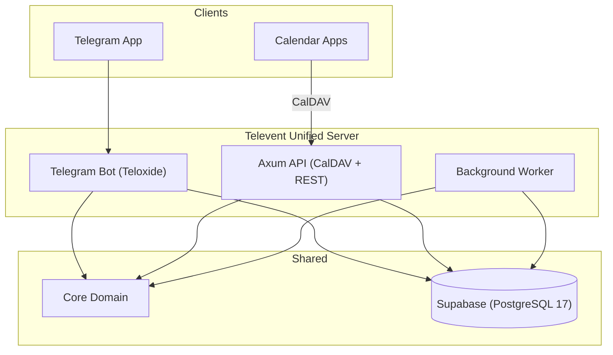

# Televent

Telegram-native calendar management with seamless CalDAV synchronization.

Televent bridges Telegram's conversational interface with standard CalDAV clients (Apple Calendar, Thunderbird, etc.), allowing for unified calendar management across platforms.

## System Architecture

The system follows a monorepo structure with shared core domain logic and multiple runtime services.



### Component Breakdown

| Path          | Description                                                      | Key Tech      |
| ------------- | ---------------------------------------------------------------- | ------------- |
| crates/core   | Domain Logic. Pure Rust, no I/O. Models, Errors, Timezone logic. | chrono, uuid  |
| crates/api    | HTTP Server. Handles CalDAV protocol and REST endpoints.         | axum, tower   |
| crates/bot    | Telegram Interface. Command parsing and conversational FSM.      | teloxide      |
| crates/worker | Job Processor. Handles emails, notifications, and cleanups.      | tokio, lettre |
| crates/server | Unified Entry Point. Runs API, Bot, and Worker in one process.   | tokio         |
| crates/web    | [PLANNED] Frontend. Web dashboard for settings.                  | dioxus        |
| migrations/   | Database Schema. SQLx migration files.                           | sql           |

## Bot Commands

### Account Setup
- /start - Initialize account and show setup instructions
- /device add <name> - Generate CalDAV password for a device
- /device list - Show all device passwords
- /device revoke <id> - Delete a device password

### Event Management
- /list - List upcoming events (next 7 days)
- /cancel <event_id> - Cancel an event

### Coordination
- /invite <user> - Invite a user to an event
- /rsvp <event_id> <status> - Respond to an event invitation

### Privacy
- /export - Request GDPR data export
- /delete_account - Initiate account deletion (30-day grace period)

### Event Creation Format
To create an event, send a message with the following format:
```text
Event Title
Date/Time (e.g., 'tomorrow 10am', 'next monday 14:00', '2026-01-25 14:00')
Duration in minutes (optional, default: 60)
Location (optional)
```

## Technical Implementation Details

### Interceptor Pattern
The system generates internal email addresses (tg_telegramid@televent.internal). The background worker intercepts invites to these addresses and routes them to the Telegram Bot API as messages instead of sending them via SMTP.

### Outbox Pattern
Database transactions include both the data change and a pending record in the `outbox_messages` table. The background worker polls this table to perform side effects (emails, TG messages), ensuring atomicity and reliability.

### CalDAV Protocol
- ETag: SHA256 hash of the serialized event fields (clock-skew resistant).
- Sync Token: Atomic counter incremented on changes (Postgres sequence/RETURNING).
- Optimistic Locking: Updates require a matching ETag via If-Match header.

## Development and Operations

### Prerequisites
- [Nix](https://nixos.org/download.html) (recommended) or [Rust](https://www.rust-lang.org/tools/install)
- [Node.js](https://nodejs.org/) (for Supabase CLI)
- [Docker](https://www.docker.com/) (for running Supabase locally)

### Common Commands
- `just setup-dev` - Initial setup (Supabase + migrations)
- `just run` - Run unified server (API, Bot, and Worker)
- `just test` - Run all tests
- `just test-coverage` - Run tests with coverage report
- `just db-start` - Start local Supabase stack
- `just db-stop` - Stop local Supabase stack
- `just db-status` - Check Supabase status
- `just db-reset` - Reset local database and apply migrations
- `just lint` - Run clippy, fmt, and check

### Agent Rules
- No unwrap() or expect(): Use explicit error handling to prevent data loss.
- No println!(): Use tracing macros for structured production logs.
- Newtypes for IDs: Use specific wrappers (e.g., UserId(Uuid)) to prevent ID confusion.
- Tokio Runtime: The entire stack is built on the Tokio async runtime.
- Migrations: Changes to core/src/models.rs REQUIRE a database migration.

## Project Roadmap

### Phase 2: Internal Invites (Current)
- [x] Database schema for attendees and RSVPs.
- [x] Implementation of the Interceptor logic in the worker.
- [x] Bot commands for RSVP management (/invite, /rsvp).
- [ ] Logic for sending Telegram notifications to invitees.

### Phase 3: Staging and QA
- Validation against Supabase (production-like Postgres).
- Full end-to-end testing with GUI CalDAV clients.

### Phase 4: Production Deployment
- Railway deployment (api, bot, worker).
- Live environment manual QA.

### Phase 5 & 6: Future
- Dioxus-based web calendar interface.
- SMTP integration for external (non-Televent) invites.

## Current Status

### Working
- PostgreSQL Database infrastructure.
- Axum API Server with CalDAV support (RFC 4791 compliant).
- Telegram Bot core commands and event creation parsing.
- Background worker for outbox processing (emails and Telegram notifications).
- Unified server process running all services.
- CalDAV basic auth and event synchronization (verified with curl/cadaver).
- Event invitations and RSVP via Telegram Bot.