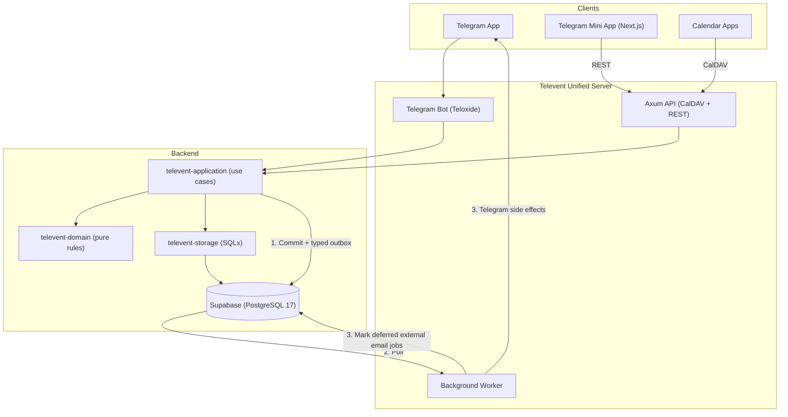
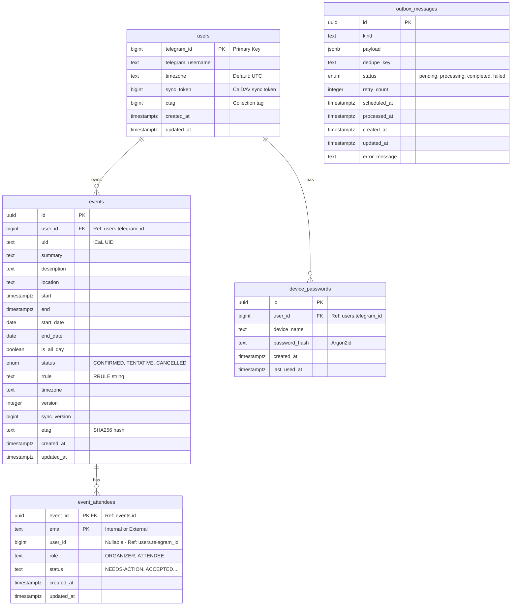

# Televent

Telegram-native calendar management with seamless CalDAV synchronization.

Televent bridges Telegram's conversational interface with standard CalDAV clients (Apple Calendar, Thunderbird, etc.), allowing for unified calendar management across platforms.

## System Architecture

The backend is layered around application services. REST, CalDAV, Telegram bot
handlers, and the worker are adapters; calendar mutations go through
`CalendarService`, which owns transaction boundaries, ETags, iCalendar sequence
increments, sync-token bumps, tombstones, attendees, and typed outbox writes.
Device password lifecycle goes through `DeviceService`, so password policy and
device writes stay out of protocol adapters.


```mermaid
flowchart TB
    subgraph Clients
        TG["Telegram App"]
        TMA["Telegram Mini App (Next.js)"]
        CAL["Calendar Apps"]
    end

    subgraph "Televent Unified Server"
        API["Axum API (CalDAV + REST)"]
        BOT["Telegram Bot (Teloxide)"]
        WORKER["Background Worker"]
    end

    subgraph Backend
        DOMAIN["televent-domain (pure rules)"]
        APP["televent-application (use cases)"]
        STORAGE["televent-storage (SQLx)"]
        DB[("Supabase (PostgreSQL 17)")]
    end

    TG --> BOT
    TMA -->|REST| API
    CAL -->|CalDAV| API

    BOT --> APP
    API --> APP
    APP --> DOMAIN
    APP --> STORAGE
    STORAGE --> DB

    APP -->|1. Commit + typed outbox| DB
    DB -->|2. Poll| WORKER
    WORKER -->|3. Telegram side effects| TG
    WORKER -->|3. Mark deferred external email jobs| DB
```

### Component Breakdown

| Path                | Description                                                     | Key Tech                       |
| ------------------- | --------------------------------------------------------------- | ------------------------------ |
| backend/domain      | Pure calendar rules: timing, recurrence, ETags, RSVP parsing, outbox payload shapes. | chrono, rrule, uuid            |
| backend/application | Use cases and transaction boundaries for calendar/device writes. | tokio                          |
| backend/storage     | SQLx repositories and table mapping.                            | sqlx                           |
| backend/api         | REST and CalDAV protocol adapter library.                       | axum, tower                    |
| backend/bot         | Telegram adapter library.                                       | teloxide                       |
| backend/worker      | Typed outbox processor library.                                 | tokio, teloxide                |
| backend/shared      | Bootstrap, logging, and shared runtime utilities.               | sqlx, tracing                  |
| backend/server      | Unified Railway entry point and runtime composition for API, bot, and worker. | tokio                          |
| frontend            | Telegram Mini App and web dashboard.                            | Next.js 16, Tailwind 4, tma.js |
| backend/migrations  | Reset-safe baseline schema.                                     | sql                            |

## Database Schema


```mermaid
erDiagram
    users ||--o{ events : "owns"
    users ||--o{ device_passwords : "has"
    events ||--o{ event_attendees : "has"

    users {
        bigint telegram_id PK "Primary Key"
        text telegram_username
        text timezone "Default: UTC"
        bigint sync_token "CalDAV sync token"
        bigint ctag "Collection tag"
        timestamptz created_at
        timestamptz updated_at
    }

    events {
        uuid id PK
        bigint user_id FK "Ref: users.telegram_id"
        text uid "iCaL UID"
        text summary
        text description
        text location
        timestamptz start
        timestamptz end
        date start_date
        date end_date
        boolean is_all_day
        enum status "CONFIRMED, TENTATIVE, CANCELLED"
        text rrule "RRULE string"
        text timezone
        integer version
        bigint sync_version
        text etag "SHA256 hash"
        timestamptz created_at
        timestamptz updated_at
    }

    device_passwords {
        uuid id PK
        bigint user_id FK "Ref: users.telegram_id"
        text device_name
        text password_hash "Argon2id"
        timestamptz created_at
        timestamptz last_used_at
    }


    event_attendees {
        uuid event_id PK, FK "Ref: events.id"
        text email PK "Internal or External"
        bigint user_id "Nullable - Ref: users.telegram_id"
        text role "ORGANIZER, ATTENDEE"
        text status "NEEDS-ACTION, ACCEPTED..."
        timestamptz created_at
        timestamptz updated_at
    }

    outbox_messages {
        uuid id PK
        text kind
        jsonb payload
        text dedupe_key
        enum status "pending, processing, completed, failed"
        integer retry_count
        timestamptz scheduled_at
        timestamptz processed_at
        timestamptz created_at
        timestamptz updated_at
        text error_message
    }


```

### Schema Description

- **users**: Stores Telegram users. `telegram_id` is the primary key and links to Telegram's ecosystem. Calendar data (`sync_token`, `ctag`) is merged directly into this table (each user has one calendar).
- **events**: Calendar events. Linked to `users` via `user_id` (telegram_id). Supports both time-based and date-based (all-day) events.
- **event_attendees**: Participants in events. Uses a composite primary key `(event_id, email)`. Can be internal (linked via `user_id` if known) or external (email only).
- **device_passwords**: App-specific passwords for CalDAV clients (Thunderbird, iOS) to authenticate using Basic Auth, as Telegram doesn't provide passwords.
- **outbox_messages**: Transactional outbox for asynchronous tasks like Telegram notifications, RSVP notices, and deferred external email. Messages use typed Rust payloads and store `kind`, `payload`, and optional `dedupe_key`; the schema restricts `kind` to known Rust `OutboxKind` discriminators.

## Bot Commands

### Account Setup
- `/start` - Initialize account and see welcome message
- `/device` - Manage CalDAV device passwords (add/list/revoke)
- `/deleteaccount` - Delete your account and all data (GDPR)

### Event Management
- `/list` - List upcoming events
- `/cancel` - Cancel/delete an event
- `/export` - Export calendar as .ics file

### Coordination
- `/invite` - Invite someone to an event
- `/rsvp` - Respond to event invitations

### Help
- `/help` - Show help message

### Event Creation Format
To create an event, send a message with the following format:
```text
Event Title
Date/Time (e.g., 'tomorrow 10am', 'next monday 14:00', '2026-01-25 14:00')
Duration in minutes (optional, default: 60)
Location (optional)
```

## Technical Implementation Details

### Interceptor Pattern
The system generates internal email addresses (tg_telegramid@televent.internal). The application service resolves these addresses into typed Telegram invite outbox jobs. External invitees are recorded as typed `external_email_deferred` jobs; the current worker makes that deferral explicit instead of attempting SMTP delivery.

### Outbox Pattern (Reliable Messaging)
The system uses the **Transactional Outbox** pattern to ensure that side effects (like sending a Telegram notification or recording an external-email deferral) are guaranteed to happen if a database transaction succeeds.

1.  **Atomicity**: Both the data change (e.g., creating an event) and the "outbox" record are committed in a single database transaction.
2.  **Reliability**: The Background Worker polls the `outbox_messages` table and processes pending items. If a process fails or the worker crashes, the message remains in the outbox (often with a retry count) and will be picked up again.
3.  **Decoupling**: The main request handlers (Bot or API) don't wait for external delivery work, making the system more responsive and resilient to Telegram API outages.

### CalDAV Protocol
- ETag: deterministic SHA256 from domain event fields, sequence, and attendees.
- Sync Token: numeric user calendar counter bumped once per application mutation.
- Tombstones: deletes write `event_tombstones` so sync-collection can return removed resources as `404`.
- Optimistic Locking: updates and deletes honor `If-Match` ETags.

### REST Event Contract
REST create/update requests use an explicit timing discriminator instead of
storage-shaped fields:

```json
{
  "uid": "event-uid",
  "summary": "Timed event",
  "timing": {
    "kind": "timed",
    "start": "2026-06-01T10:00:00Z",
    "end": "2026-06-01T11:00:00Z",
    "timezone": "UTC"
  }
}
```

```json
{
  "uid": "event-uid",
  "summary": "All-day event",
  "timing": {
    "kind": "all_day",
    "start_date": "2026-06-01",
    "end_date": "2026-06-02"
  }
}
```

Responses intentionally hide internal sync fields such as raw ETags,
`sync_version`, and storage timestamps.

### Frontend Architecture
- **Framework**: Next.js 16 (React 19) with App Router.
- **Integration**: `tma.js` for Telegram Mini App bidirectional communication.
- **Styling**: Tailwind CSS v4 with `@catppuccin/tailwindcss` plugin for themes.
- **Type Safety**: frontend contracts are DTO-oriented and kept valid against API request/response shapes.


## Development and Operations

### Prerequisites
- [Nix](https://nixos.org/download.html) (recommended)
- [Rust](https://www.rust-lang.org/tools/install) (if not using Nix)
- [Node.js](https://nodejs.org/) & [pnpm](https://pnpm.io/)
- [Supabase CLI](https://supabase.com/docs/guides/cli)
- [Docker](https://www.docker.com/) (for local database)

### Common Commands

#### General
- `just setup-dev` - Initial setup (Supabase + migrations + build)
- `just run` - Run unified server (API, Bot, and Worker)
- `just upgrade` - Upgrade backend dependencies
- `just upgrade-frontend` - Upgrade frontend dependencies

#### Testing & Quality
- `just test` - Run fast backend tests that do not require `DATABASE_URL`, plus doc tests
- `just test-db` - Run the full backend suite, including DB-backed `sqlx::test` cases; requires `DATABASE_URL`
- `just test-coverage` - Run tests with coverage report
- `just lint` - Run backend check, formatting check, and clippy without mutating files
- `just lint-frontend` - Run frontend linting (ESLint)
- `just typecheck-frontend` - Run frontend TypeScript type checking
- `just fmt-frontend` - Run frontend formatting (Prettier)
- `just build-docker` - Build the unified Railway Docker image locally

#### Database
- `just db-start` / `db-stop` - Manage local Supabase stack
- `just db-status` - Check Supabase status
- `just db-reset` - Full reset: drop db, re-create, apply migrations
- `just gen-types` - Regenerate OpenAPI JSON and TypeScript types from API DTOs

### Agent Rules
- **No unwrap()/expect()**: Use explicit error handling.
- **Structured Logging**: Use `tracing` macros, never `println!`.
- **Type Safety**: Keep internal IDs strongly typed while exposing API DTOs as explicit wire shapes.
- **Tokio**: Use Tokio async runtime for everything.

## Project Roadmap

### Phase 2: Internal Invites (Current)
- [x] Database schema for attendees and RSVPs.
- [x] Application-level invite routing for internal Telegram users and deferred external email.
- [x] Bot commands for RSVP management (/invite, /rsvp).
- [x] Logic for sending Telegram notifications to invitees.

### Phase 3: Staging and QA
- Validation against Supabase (production-like Postgres).
- Full end-to-end testing with GUI CalDAV clients.

### Phase 4: Frontend Development (Current)
- [x] Next.js foundation with Telegram SDK (tma.js).
- [x] Event Management (CRUD)
    - [x] Create/Edit Event Form (Catppuccin Mocha Theme)
    - [x] Event Listing
    - [x] Event Deletion
- [x] OpenAPI DTO generation for Rust-to-TypeScript API contract safety.
- [ ] Mock mode for quick local iteration.

### Phase 5: Production Deployment
- Railway deployment (API, Bot, Worker, and Static Frontend).
- Live environment manual QA within Telegram.

### Phase 6: Expansion
- Extending the frontend to act as a standalone Web App.
- Optional delivery adapter for deferred external email invites.

## Current Status

### Working
- PostgreSQL Database infrastructure.
- Axum API Server with CalDAV support (RFC 4791 compliant).
- Telegram Bot core commands and event creation parsing.
- Background worker for typed Telegram notifications and explicit external-email deferrals.
- Unified server process running all services.
- CalDAV basic auth and event synchronization (verified with curl/cadaver).
- Event invitations and RSVP via Telegram Bot (Internal Invites fully enabled).
- Frontend:
    - Next.js + Tailwind + tma.js setup complete.
    - Basic routing and UI components (Catppuccin theme) implemented.
    - Event Creation/Edit Form and Event Listing fully integrated.
    - Event Deletion implemented.
    - Integration with Backend API complete.

### In Progress
- Mock mode for quick local iteration.
- Production deployment (Railway).
