# Televent Architecture

This document provides visual architecture diagrams for the Televent calendar system.

## System Overview

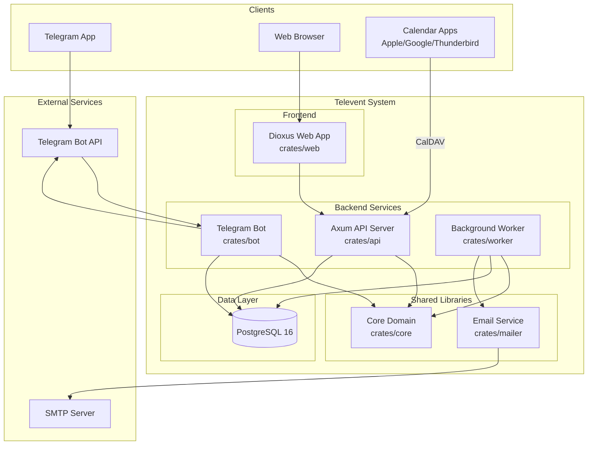

## Crate Dependencies

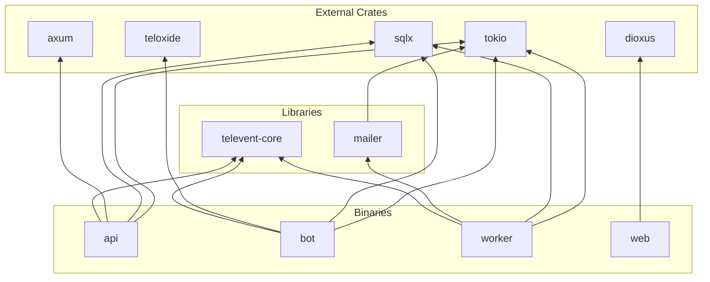

## API Request Flow

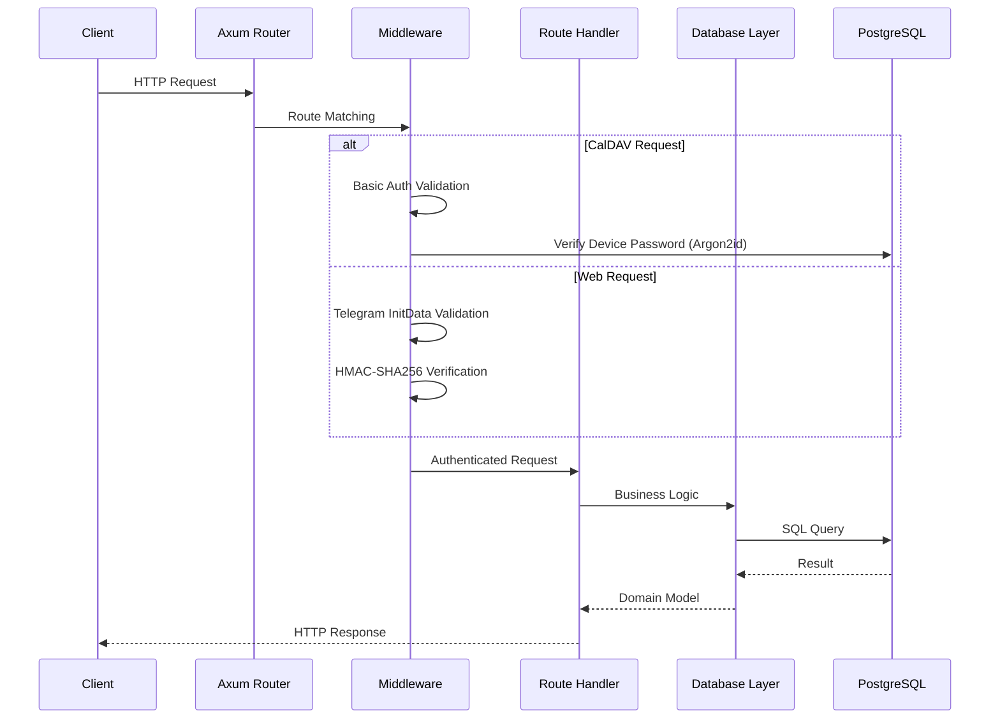

## CalDAV Protocol Flow

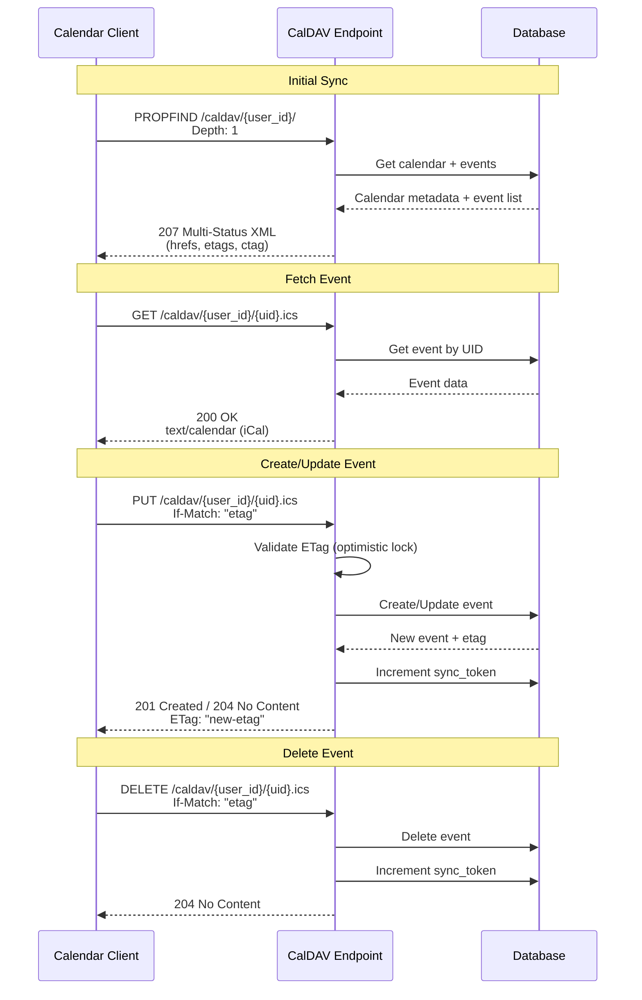

## CalDAV REPORT Method Flow

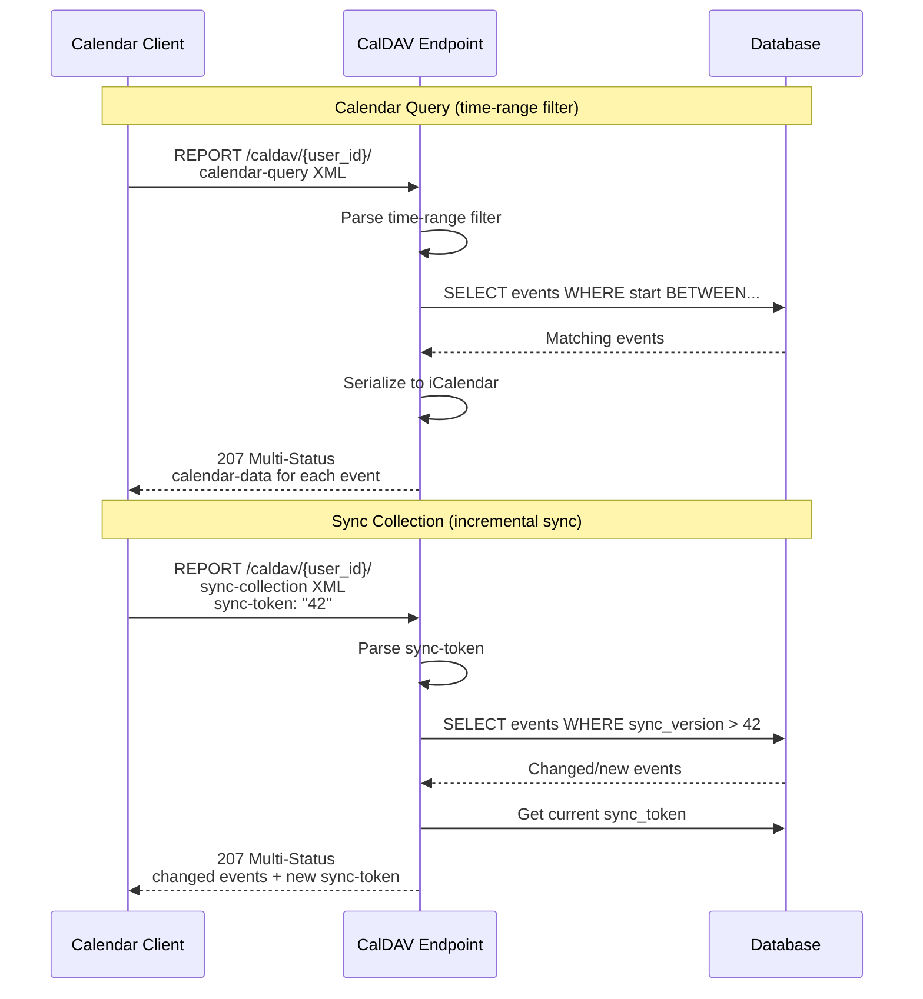

## REST API Endpoints

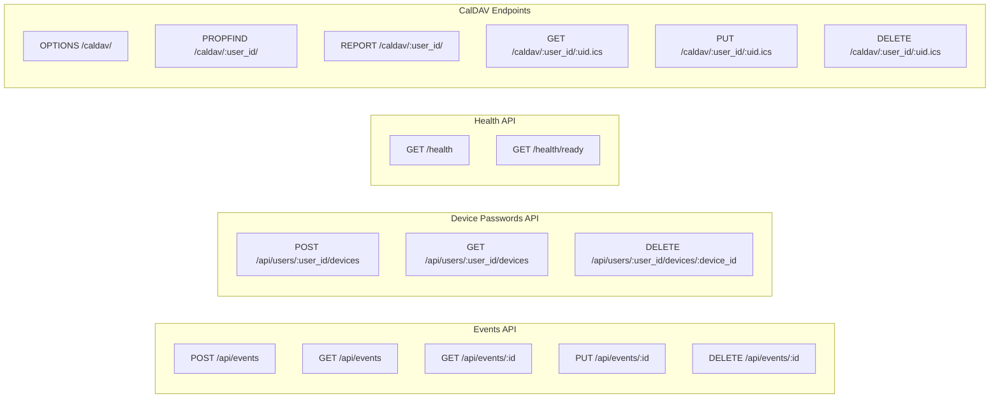

## Device Password Management Flow

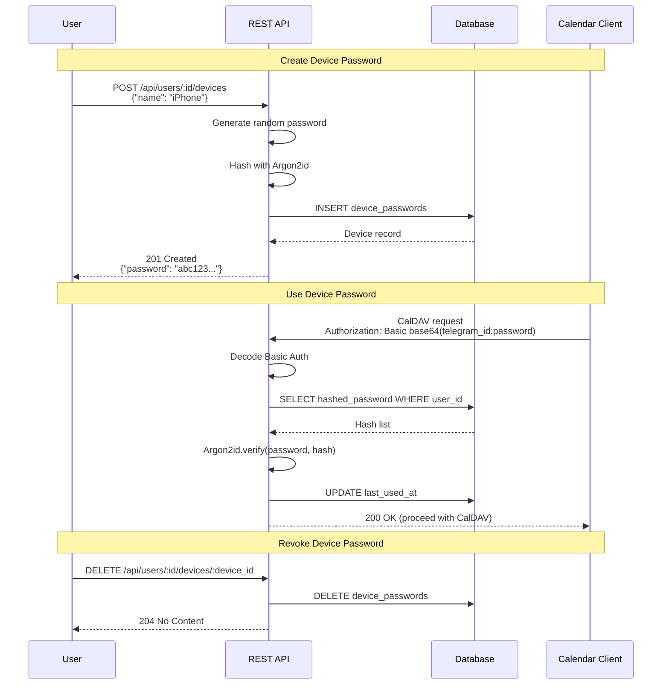

## Database Schema

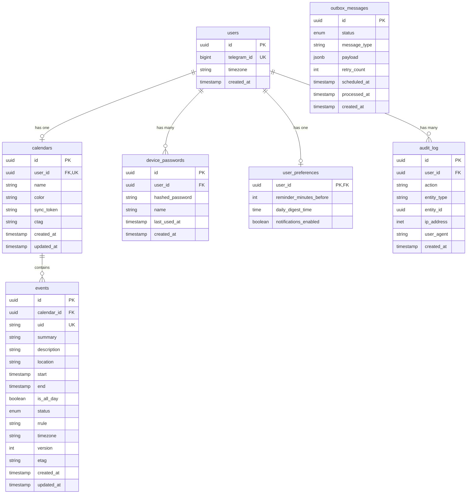

## Authentication Flows

### Web UI Authentication (Telegram Login Widget)

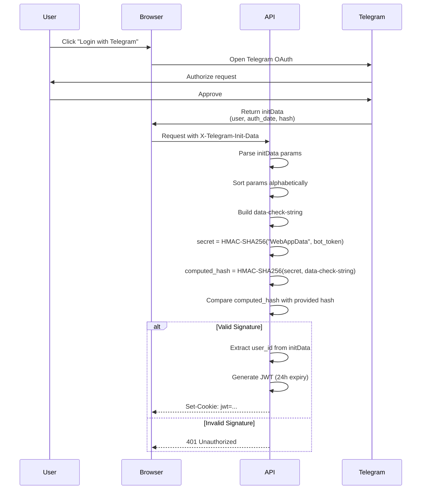

### CalDAV Authentication (HTTP Basic Auth)

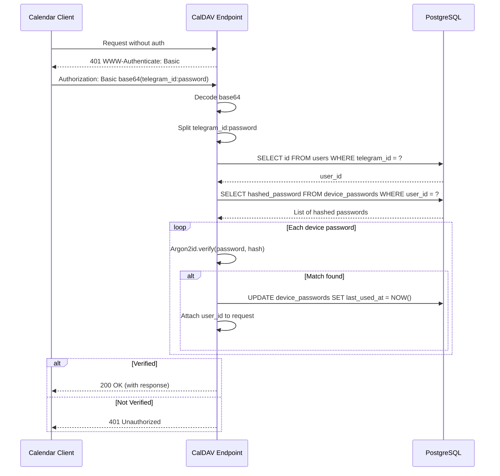

## Worker Message Processing (Outbox Pattern)

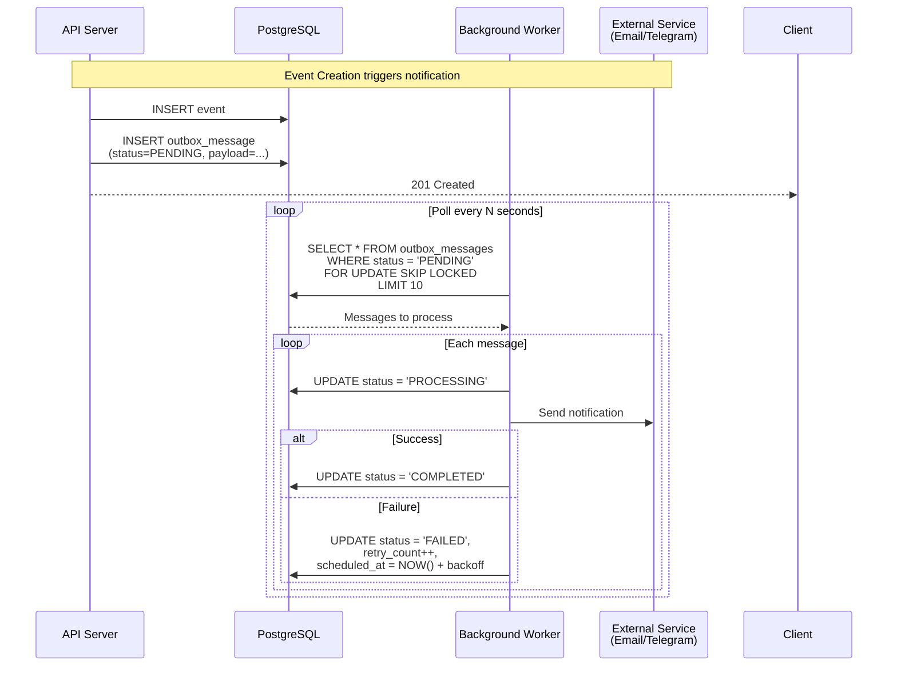

## ETag Generation

```mermaid
flowchart LR
    subgraph "Event Fields"
        UID[uid]
        SUM[summary]
        DESC[description]
        LOC[location]
        START[start]
        END[end]
        ALLDAY[is_all_day]
        STATUS[status]
        RRULE[rrule]
    end

    subgraph "Process"
        CONCAT[Concatenate with '|' separator]
        SHA[SHA-256 Hash]
        HEX[Hex Encode]
    end

    UID --> CONCAT
    SUM --> CONCAT
    DESC --> CONCAT
    LOC --> CONCAT
    START --> CONCAT
    END --> CONCAT
    ALLDAY --> CONCAT
    STATUS --> CONCAT
    RRULE --> CONCAT

    CONCAT --> SHA
    SHA --> HEX
    HEX --> ETAG[ETag]
```

## Directory Structure

```
televent/
├── crates/
│   ├── api/                 # Axum HTTP server
│   │   └── src/
│   │       ├── main.rs      # Server entry point
│   │       ├── config.rs    # Environment config
│   │       ├── error.rs     # Error types & conversions
│   │       ├── routes/      # HTTP handlers
│   │       │   ├── caldav.rs      # CalDAV protocol
│   │       │   ├── caldav_xml.rs  # XML generation
│   │       │   ├── events.rs      # REST API
│   │       │   ├── health.rs      # Health check
│   │       │   └── ical.rs        # iCal serialization
│   │       ├── middleware/  # Auth middleware
│   │       │   ├── caldav_auth.rs    # Basic Auth
│   │       │   └── telegram_auth.rs  # Telegram OAuth
│   │       └── db/          # Database layer
│   │           ├── calendars.rs
│   │           └── events.rs
│   │
│   ├── bot/                 # Telegram bot
│   │   └── src/main.rs
│   │
│   ├── core/                # Shared domain logic
│   │   └── src/
│   │       ├── models.rs    # Domain entities
│   │       ├── error.rs     # Domain errors
│   │       └── timezone.rs  # TZ utilities
│   │
│   ├── mailer/              # Email service
│   │   └── src/lib.rs
│   │
│   ├── web/                 # Dioxus frontend
│   │   └── src/main.rs
│   │
│   └── worker/              # Background jobs
│       └── src/main.rs
│
├── migrations/              # SQLx migrations
├── docs/                    # Documentation
├── Cargo.toml              # Workspace config
├── Justfile                # Task runner
├── docker-compose.yml      # Local services
└── CLAUDE.md               # AI assistant rules
```

## Key Design Decisions

| Decision | Rationale |
|----------|-----------|
| **ETag = SHA256(all fields)** | Clock-skew resistant. Avoids false conflicts from timestamp differences. |
| **Sync token = atomic counter** | `UPDATE ... RETURNING` ensures concurrent syncs never see same token. |
| **One calendar per user** | Simplifies CalDAV implementation. Enforced by unique index. |
| **Argon2id for passwords** | Memory-hard algorithm resistant to GPU attacks. |
| **Outbox pattern for notifications** | Ensures at-least-once delivery. Survives server crashes. |
| **`FOR UPDATE SKIP LOCKED`** | Prevents duplicate job processing in worker. |
| **No `unwrap()`/`expect()`** | Calendar data loss from panics is unacceptable. |
| **Newtypes for IDs** | Prevents mixing `UserId` with `CalendarId` at compile time. |

## Performance Indices

```sql
-- Fast event queries by calendar and time range
CREATE INDEX idx_events_calendar_start ON events(calendar_id, start);

-- Sync queries for modified events
CREATE INDEX idx_events_calendar_updated ON events(calendar_id, updated_at);

-- CalDAV UID lookups (unique per calendar)
CREATE UNIQUE INDEX idx_events_calendar_uid ON events(calendar_id, uid);

-- Worker polling for pending messages
CREATE INDEX idx_outbox_pending ON outbox_messages(status, scheduled_at)
    WHERE status = 'PENDING';

-- Audit log queries
CREATE INDEX idx_audit_user_time ON audit_log(user_id, created_at DESC);
```
