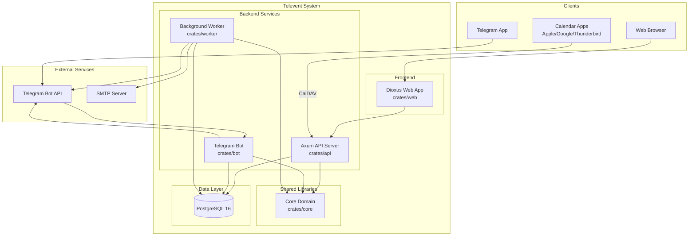
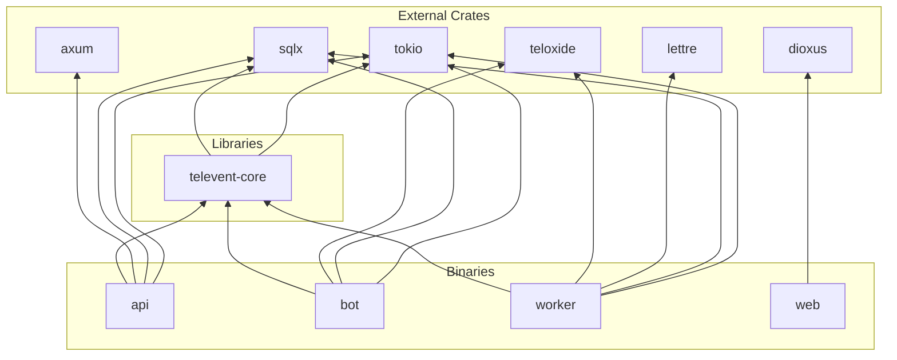
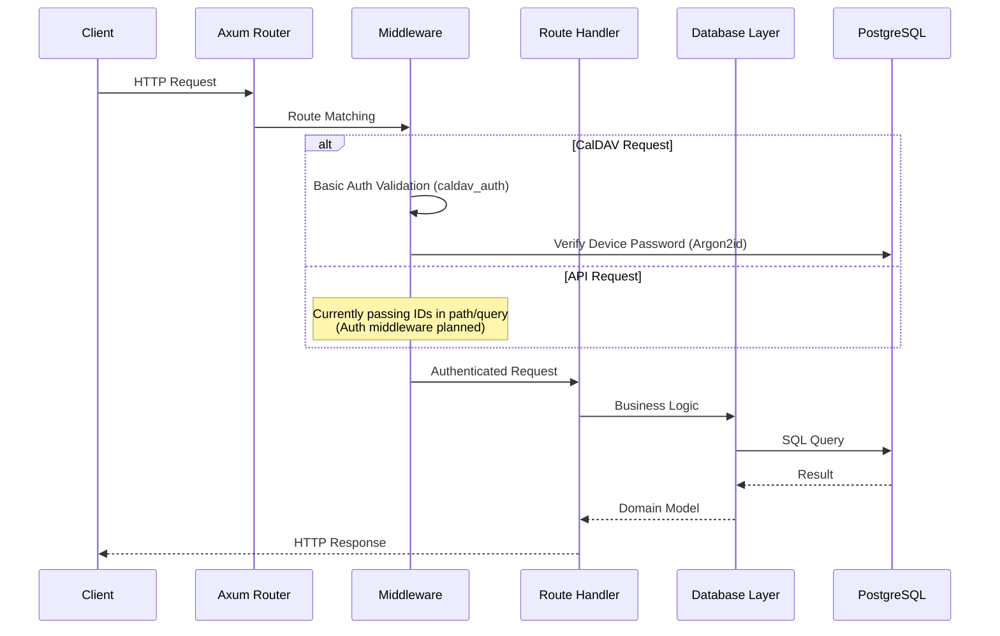
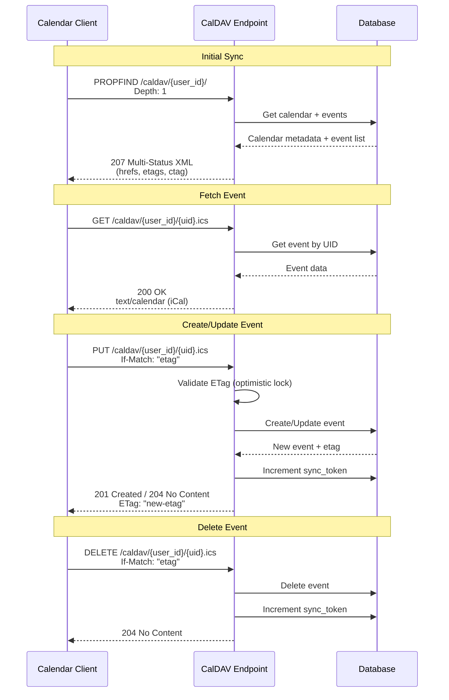
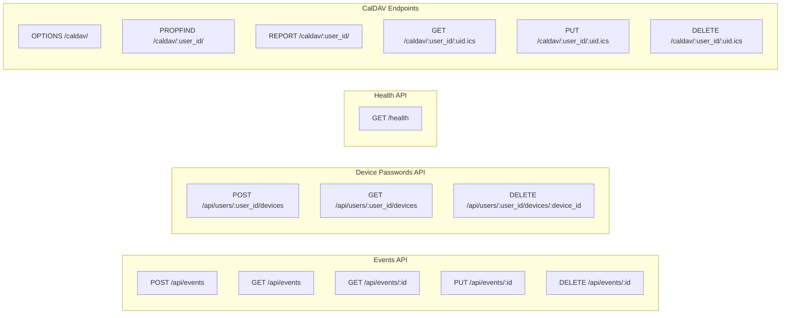
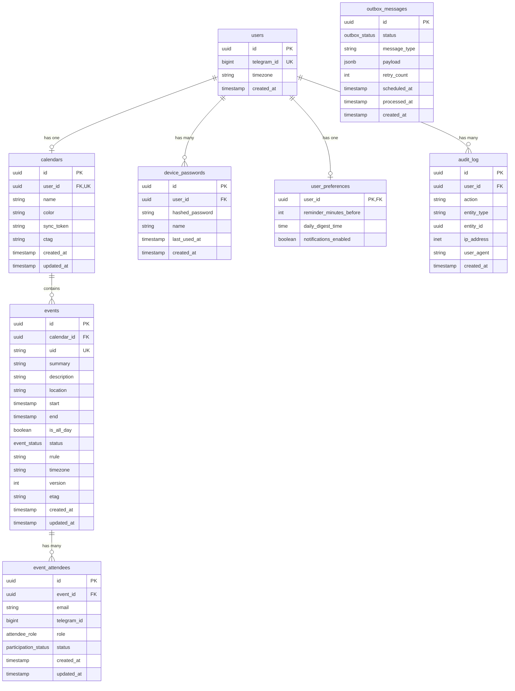
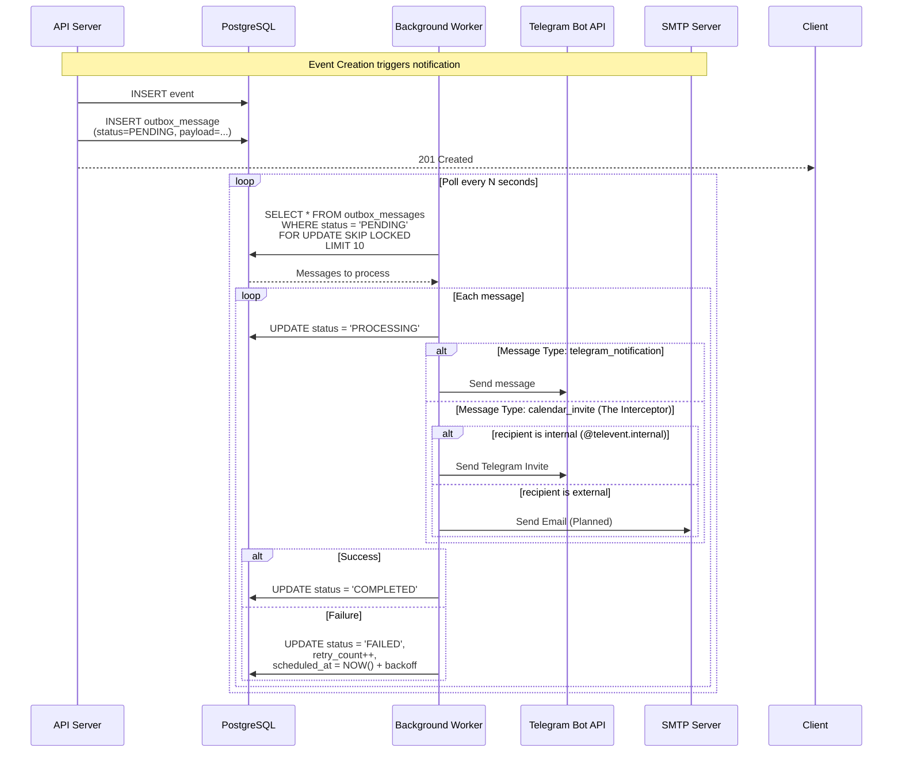

# Televent Architecture

This document provides visual architecture diagrams for the Televent calendar system.

## System Overview



## Crate Dependencies



## API Request Flow



## CalDAV Protocol Flow



## REST API Endpoints



## Database Schema



## Worker Message Processing (Outbox Pattern)



## Directory Structure

```
televent/
├── crates/
│   ├── api/                 # Axum HTTP server
│   │   └── src/
│   │       ├── main.rs      # Server entry point
│   │       ├── config.rs    # Environment config
│   │       ├── error.rs     # Error types & conversions
│   │       ├── routes/      # HTTP handlers
│   │       │   ├── caldav.rs      # CalDAV protocol
│   │       │   ├── caldav_xml.rs  # XML generation
│   │       │   ├── devices.rs     # Device passwords REST
│   │       │   ├── events.rs      # Events REST API
│   │       │   ├── health.rs      # Health check
│   │       │   └── ical.rs        # iCal serialization
│   │       ├── middleware/  # Auth middleware
│   │       │   ├── caldav_auth.rs    # Basic Auth
│   │       │   └── rate_limit.rs     # Rate limiting
│   │       └── db/          # Database layer (db-specific logic)
│   │           ├── calendars.rs
│   │           └── events.rs
│   │
│   ├── bot/                 # Telegram bot (Teloxide)
│   │   └── src/
│   │       ├── main.rs      # Bot entry point
│   │       ├── commands.rs  # Command definitions
│   │       ├── handlers.rs  # Update handlers
│   │       └── db.rs        # Bot-specific DB helpers
│   │
│   ├── core/                # Shared domain logic
│   │   └── src/
│   │       ├── lib.rs       # Crate entry
│   │       ├── models.rs    # Domain entities (Shared)
│   │       ├── error.rs     # Domain errors
│   │       ├── attendee.rs  # Attendee utilities (The Interceptor)
│   │       ├── recurrence.rs # Recurrence logic
│   │       └── timezone.rs  # TZ utilities
│   │
│   ├── web/                 # Dioxus frontend
│   │   └── src/main.rs
│   │
│   └── worker/              # Background jobs
│       └── src/
│           ├── main.rs      # Worker entry point
│           ├── processors.rs # Message processing logic
│           ├── mailer.rs    # Integrated email service
│           └── db.rs        # Worker-specific DB helpers
│
├── migrations/              # SQLx migrations
├── docs/                    # Documentation
├── Cargo.toml              # Workspace config
├── Justfile                # Task runner
├── docker-compose.yml      # Local services
└── CLAUDE.md               # AI assistant rules
```

## Key Design Decisions

| Decision | Rationale |
|----------|-----------|
| **The Interceptor Pattern** | Internal invites (@televent.internal) are routed to Telegram, avoiding paid SMTP for MVP. |
| **ETag = SHA256(all fields)** | Clock-skew resistant. Avoids false conflicts from timestamp differences. |
| **Sync token = atomic counter** | `UPDATE ... RETURNING` ensures concurrent syncs never see same token. |
| **One calendar per user** | Simplifies CalDAV implementation. Enforced by unique index. |
| **Argon2id for passwords** | Memory-hard algorithm resistant to GPU attacks. |
| **Outbox pattern for notifications** | Ensures at-least-once delivery. Survives server crashes. |
| **`FOR UPDATE SKIP LOCKED`** | Prevents duplicate job processing in worker. |
| **No `unwrap()`/`expect()`** | Calendar data loss from panics is unacceptable. (Enforced by Clippy) |
| **Newtypes for IDs** | Prevents mixing `UserId` with `CalendarId` at compile time. |
